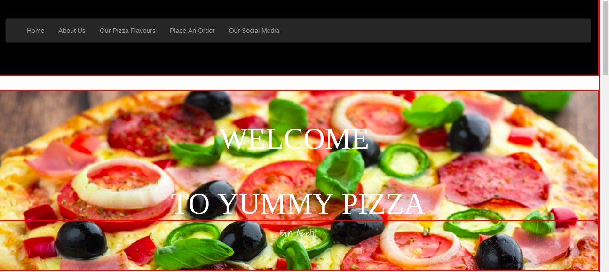

# Yummy-Pizza

This is a website that you can customize your own pizza then place and order and choose whether you want it to be delivered to your or you will go collect it yourself to the nearest branch
, {17 June 2019}

#### By **{Emmanuel Muchiri}**

## Screenshots

;
;
;
;
;
;
;

## Description

{This is a website that you can customize your own pizza then place and order and choose whether you want it to be delivered to your or you will go collect it yourself to the nearest branch
}

## Behavior Driven Development

| Behavior :                                                |                                                Input                                                |                                                                             Output example |
| :-------------------------------------------------------- | :-------------------------------------------------------------------------------------------------: | -----------------------------------------------------------------------------------------: |
| User selects pizza size,crust and topping (s)|Pizza Size : Large,Pizza Crust :Crispy,Pizza Topping :Bacon,Total Cost : 1100 |Pizza Size : Large,Pizza Crust :Crispy,Pizza Topping :Bacon,Total Cost : 1100                                           |                                                |
| User Enters the appropriate inputs in the contact us form |City Name:Nairobi,City Avenue :Moi,City Street Name:Muindi Mbingu, Name Of Building:Rehani House,Phone Number:+25470693843 | Thank You For Oddering Your Pizza.Deliver Fee is Ksh 200.Go back Home homepage.|

## Setup/Installation Requirements

-   Connect to the internet
-   Download a web browser of your preference
-   click here to open the link : <https://emmanuelmuchiri.github.io/Yummy-Pizza/>
    ## Known Bugs
    {In case you experience bugs kindly refresh your web page or restart your web browser }
    ## Technologies Used
    { 1 .HTML
      2, CSS
      3, bootstrap
      4, jquery
      5, javascript
    }
    ## Support and contact details
    {Contact me on my email address :Emmanuel.Muchiri@outlook.com}
    ### License
    MIT License
    Copyright (c) {2019}
